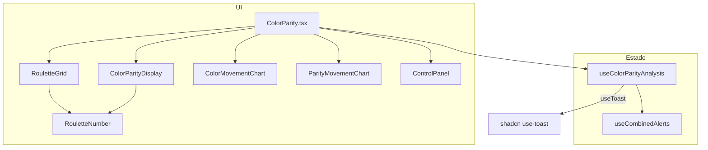

> **Integração neste repositório:** a interface interactiva (mesa, alerta combinado, gráficos cor/paridade, áudio) está na rota **`/doc-calculadora-roulette`** da app, separada deste texto. O conteúdo abaixo mantém-se como referência técnica.

---

# Documentação — Calculadora da Roleta (cor, paridade e alertas)

Este documento descreve a **Calculadora da Roleta** do projeto Bate Certo: regras da roleta europeia usadas no código, fluxo de dados, API dos hooks e props dos componentes, para puder **reutilizar a lógica ou copiar módulos** para outro projeto (React ou não).

---

## 1. Visão geral

A calculadora permite:

1. **Registar resultados** da roleta europeia (números **0–36**) por ordem cronológica.
2. **Calcular sequências** atuais de cor, paridade e altura (baixo/alto).
3. **Gerar “alertas combinados”** quando existem sequências mínimas de **cor** e **paridade** em simultâneo, com **confiança** estimada e **ajuste de estratégia** após perdas consecutivas.
4. **Pontuar** vitórias/derrotas do alerta (scores de cor e paridade) e opcionalmente **ler o alerta em voz alta** (Web Speech API, `pt-BR`).
5. **Visualizar** últimos números num mini-grid 1×6, gráficos de “movimento” de cor e de paridade (Recharts), e a mesa completa para clique.

Domínio: **roleta europeia** — um zero verde; números 1–36 com cor fixa (vermelho/preto) segundo tabela padrão.

---

## 2. Mapeamento de números (regra de negócio crítica)

Todos os ficheiros relevantes usam a **mesma lista de vermelhos**. Qualquer cópia para outro projeto deve manter esta lista **idêntica** ou os alertas e gráficos deixam de bater certo com a mesa real.

| Propriedade | Regra |
|-------------|--------|
| **Intervalo válido** | `0` a `36` (inteiros). |
| **Zero** | Cor e paridade tratados como **`neutro`** na lógica de sequências e alertas; no UI é “verde”. |
| **Vermelho** | `[1, 3, 5, 7, 9, 12, 14, 16, 18, 19, 21, 23, 25, 27, 30, 32, 34, 36]` |
| **Preto** | Qualquer outro de 1–36 que não esteja na lista acima. |
| **Par / Ímpar** | `n % 2 === 0` → par; ímpar caso contrário (0 é neutro). |
| **Baixo / Alto** | `1–18` → baixo; `19–36` → alto; `0` → neutro. |

Funções equivalentes (pseudocódigo para qualquer linguagem):

```ts
const RED_NUMBERS = [1, 3, 5, 7, 9, 12, 14, 16, 18, 19, 21, 23, 25, 27, 30, 32, 34, 36];

function getNumberColor(n: number): 'vermelho' | 'preto' | 'neutro' {
  if (n === 0) return 'neutro';
  return RED_NUMBERS.includes(n) ? 'vermelho' : 'preto';
}

function getNumberParity(n: number): 'par' | 'impar' | 'neutro' {
  if (n === 0) return 'neutro';
  return n % 2 === 0 ? 'par' : 'impar';
}

function getNumberHeight(n: number): 'baixo' | 'alto' | 'neutro' {
  if (n === 0) return 'neutro';
  return n <= 18 ? 'baixo' : 'alto';
}
```

---

## 3. Arquitetura no repositório actual



| Ficheiro | Função |
|----------|--------|
| `src/pages/ColorParity.tsx` | Página: tema escuro, `DashboardLayout`, ligação de estado aos componentes. |
| `src/hooks/useColorParityAnalysis.ts` | Estado principal, histórico, sequências, scores, áudio, integração com alertas. |
| `src/hooks/useCombinedAlerts.ts` | Lógica do **alerta combinado** (ativação, confiança, perdas consecutivas, inversão de cor/paridade). |
| `src/components/RouletteGrid.tsx` | Mesa 0 + 1–36, desfazer / apagar último / limpar. |
| `src/components/RouletteNumber.tsx` | Célula clicável com cores Tailwind `roulette-*`. |
| `src/components/ColorParityDisplay.tsx` | Alerta ativo, grid 1×6, contagens e scores. |
| `src/components/ColorMovementChart.tsx` | Gráfico Recharts a partir de `history`. |
| `src/components/ParityMovementChart.tsx` | Idem para paridade. |
| `src/components/ControlPanel.tsx` | Relógio, temporizador de sessão, switches áudio/tema. |

---

## 4. Hook principal — `useColorParityAnalysis`

**Localização:** `src/hooks/useColorParityAnalysis.ts`

### 4.1 Retorno (API pública)

| Membro | Tipo | Descrição |
|--------|------|-----------|
| `state` | `ColorParityState` | Estado reativo completo (ver secção 4.2). |
| `addNumber(n)` | `(n: number) => void` | Acrescenta `n` ao histórico, recalcula sequências, atualiza alerta combinado, toasts e TTS se aplicável. |
| `removeLastNumber()` | `() => void` | Remove o último número; recalcula sequências e alerta. |
| `clearAll()` | `() => void` | Zera histórico, scores, alertas e resultados de alerta. |
| `toggleAudio()` | `() => void` | Liga/desliga `state.audioEnabled` (afeta TTS em novos alertas). |
| `getGridLayout()` | `() => (number \| null)[][]` | Grelha **1×6**: os últimos até 6 números, do mais recente para o mais antigo na linha. |
| `updateWithMLPredictions` | `() => void` | **No-op** reservado para compatibilidade; pode ignorar-se noutro projeto. |

### 4.2 `ColorParityState` (campos relevantes)

| Campo | Significado |
|-------|-------------|
| `history` | `number[]` — ordem das saídas (índice 0 = mais antigo). |
| `heightSequenceCount` | Comprimento da sequência actual **baixo/alto** (quebra em `0` ou mudança de grupo). |
| `colorSequenceCount` | Idem para **cor** (quebra em `0` ou mudança vermelho/preto). |
| `heightScore` | Ajustado quando há **resultado de alerta combinado** no eixo altura (+1 / −0,5; mínimo 0). |
| `colorScore` | Ajustado quando há **resultado de alerta combinado** no eixo cor (+1 / −0,5; mínimo 0). |
| `totalWins` / `totalLosses` | Contadores globais de vitória/derrota do **alerta combinado** (vitória = **cor e altura** certas no mesmo número). |
| `currentAlert` | Objecto para UI: `type`, `targetGroup` (ex. `"vermelho-baixo"`), `targetNumbers`, `confidence`, `sequenceCount`. |
| `alertResults` | Histórico de resultados por jogada com flags `isColorWin`, `isHeightWin`, `isWin`. |
| `audioEnabled` | Controla TTS em novos alertas. |
| `convergentCount` / `divergentCount` / `lastState` / `hasFirstComparison` | Presentes no estado inicial; **o fluxo actual de `addNumber` não os actualiza** — reservados ou legado; noutro projecto pode omitir-se ou implementar-se convergência/divergência se desejado. |

**Dependência externa:** usa `useToast()` de `@/hooks/use-toast` (shadcn). Para portar sem shadcn, substituir por `console.log`, callback ou o sistema de notificações do projecto destino.

---

## 5. Hook de alertas — `useCombinedAlerts`

**Localização:** `src/hooks/useCombinedAlerts.ts`

Usado **internamente** por `useColorParityAnalysis` (não precisa de o expor na UI se duplicar só a lógica num serviço).

### 5.1 Condição de alerta

- Com histórico de comprimento ≥ 2, calcula-se a sequência actual de **cor** e de **altura** (baixo 1–18 / alto 19–36; último grupo repetido para trás até `0` ou mudança).
- **`shouldAlert`** é `true` quando **ambas** as sequências têm comprimento **≥ 2**.

### 5.2 Confiança

```text
confidence = round( clamp( (colorSequenceCount + heightSequenceCount) * 10, 60, 95 ) )
```

### 5.3 Resultado de uma jogada com alerta activo

`checkAlertResult(number, alert)`:

- Se `number === 0` → **sempre perda** em cor e altura (não acerta o alvo).
- Caso contrário compara cor e altura do número com `alert.color` e `alert.height`.

Vitória **global** no hook principal: **cor e altura** certas no **mesmo** número.

### 5.4 Ajuste após perdas consecutivas

Com alerta activo, mantêm-se contadores `consecutiveColorLosses` e `consecutiveHeightLosses`:

- Em cada nova jogada avalia-se se cor/altura “ganharam” face ao alvo.
- Após **2 perdas consecutivas** na **cor**, inverte-se o alvo de cor (`vermelho` ↔ `preto`) e zera o contador de cor.
- Idem para **altura** (`baixo` ↔ `alto`).

### 5.5 API do hook

| Retorno | Descrição |
|---------|-----------|
| `currentAlert` | Estado do alerta combinado (cor, altura, confiança, contagens, flags `isActive`). |
| `updateAlert(history)` | Recalcula com base no histórico completo; devolve o alerta actualizado (para uso síncrono no `setState` do hook pai). |
| `resetAlert()` | Limpa alerta (usado em `clearAll`). |
| `checkAlertResult` | Função pura de avaliação de um número contra o alerta. |

---

## 6. Componentes — contratos (props)

### `RouletteGrid`

| Prop | Tipo | Descrição |
|------|------|-----------|
| `onNumberClick` | `(n: number) => void` | Clique num número da mesa. |
| `selectedNumbers` | `number[]?` | Destaque visual (ex. último número). |
| `onUndo` / `onBackspace` | `() => void` | No projecto actual ambos removem o último; podem diferir noutro UX. |
| `onClear` | `() => void` | Limpa tudo (delegar a `clearAll`). |
| `canUndo` | `boolean` | Desactiva botões se histórico vazio. |

### `ColorParityDisplay`

Recebe sobretudo **fatias** de `state`: `history`, contagens de sequência, `heightScore`, `colorScore`, `parityScore`, `currentAlert`, `gridLayout`.  
Nota: no JSX actual, **altura** (`heightSequenceCount`) e **convergência** podem estar nos props mas não todos são mostrados — ao portar, alinhar props com o que a UI realmente precisa.

### `ColorMovementChart` / `ParityMovementChart`

| Prop | Tipo |
|------|------|
| `history` | `number[]` |
| `isHighlighted?` | `boolean` (só parity; opcional) |

Constroem séries internas “run-up / drawdown” por cor ou paridade ao longo das jogadas.

### `ControlPanel`

Áudio, tema, relógio (`DigitalClock`), temporizador (`SessionTimer`) — **opcionais** para uma portagem mínima.

---

## 7. Estilos (Tailwind) — `RouletteNumber`

Cores personalizadas em `tailwind.config.ts`:

```ts
roulette: {
  red: '#dc2626',
  black: '#1f2937',
  green: '#059669',
  gold: '#f59e0b',
},
```

Classes usadas: `bg-roulette-red`, `bg-roulette-black`, `bg-roulette-green`.  
Noutro projecto: copiar estas cores para o tema ou usar classes/CSS equivalentes.

---

## 8. Dependências npm relevantes

| Pacote | Uso |
|--------|-----|
| `react`, `react-dom` | UI e hooks. |
| `recharts` | Gráficos de movimento. |
| `@radix-ui/react-*` + shadcn | `Switch`, `Alert`, `Button`, `Card`, etc. |
| `lucide-react` | Ícones. |
| `tailwindcss` | Layout e cores da roleta. |

A **lógica pura** de cor/paridade/sequências/alerta pode ser extraída para ficheiros `.ts` sem React; os hooks actuais misturam UI (toast, speech).

---

## 9. Checklist para integrar noutro projecto

1. **Copiar ou reimplementar** as funções `getNumberColor`, `getNumberParity`, `getNumberHeight` com a lista de vermelhos idêntica.
2. **Portar** `useCombinedAlerts` (ou equivalente sem React: classe/funções com `history` como argumento).
3. **Portar** `useColorParityAnalysis` **ou** só consumir estado: `history` + funções `add` / `pop` / `clear` + derivados.
4. **Substituir** `useToast` e `speechSynthesis` por callbacks opcionais (`onAlert`, `onWin`, `onLoss`).
5. **UI**: `RouletteGrid` + display opcional; Recharts só se quiser os mesmos gráficos.
6. **Validação**: rejeitar números fora de `0..36` na entrada se quiser robustez.
7. **Testes recomendados**: sequências conhecidas (ex. vários vermelhos seguidos + vários pares) até `shouldAlert === true`; jogada com `0` com alerta activo → perda dupla; duas perdas de cor → inversão de cor.

---

## 10. Referência rápida de ficheiros

```
src/hooks/useColorParityAnalysis.ts   # estado + histórico + integração alertas
src/hooks/useCombinedAlerts.ts      # motor do alerta combinado
src/components/RouletteGrid.tsx
src/components/RouletteNumber.tsx
src/components/ColorParityDisplay.tsx
src/components/ColorMovementChart.tsx
src/components/ParityMovementChart.tsx
src/components/ControlPanel.tsx
src/pages/ColorParity.tsx             # exemplo de composição
tailwind.config.ts                   # cores roulette.*
```

---

*Documento gerado para reutilização da calculadora Bate Certo. A lógica de apostas é auxiliar/analítica; use com responsabilidade e em conformidade com a legislação aplicável.*
