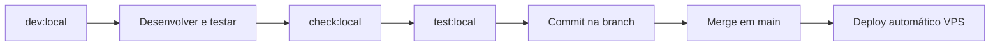

# Ambiente de teste local (sandbox)

Sandbox **isolado da produção** para desenvolver melhorias, testar tudo localmente e fazer **um único deploy** quando estiver pronto.

## O que fica isolado

| Recurso | Produção (VPS) | Sandbox local |
|---------|----------------|---------------|
| Base de dados | `/var/www/stake37/data/singlestake.db` | `data/local/singlestake.db` |
| Estratégia global | `data/automation/…` | `data/local/roulette-strategy-global.json` |
| Simulação automação | `data/automation/…` | `data/local/roulette-automation-sim.json` |
| Config | `.env` na VPS | `.env.development.local` (não versionado) |

Nada em `data/local/` vai para o git nem para a VPS.

---

## Arranque rápido (Windows)

### Se `npm install` der erro de "execução de scripts desabilitada"

No PowerShell isto é comum. Use **uma** destas opções:

**Opção A — CMD (mais simples, recomendado)**

```cmd
cd C:\Users\PC\Documents\GitHub\singlestake
scripts\dev-local.cmd
```

**Opção B — `npm.cmd` no PowerShell** (contorna o bloqueio do `npm.ps1`)

```powershell
cd C:\Users\PC\Documents\GitHub\singlestake
npm.cmd install
npm.cmd run dev:local
```

**Opção C — Permitir scripts só para o seu utilizador** (uma vez)

```powershell
Set-ExecutionPolicy -Scope CurrentUser RemoteSigned
```

Depois disso, `npm install` e `npm run dev:local` funcionam normalmente.

---

### Arranque normal (se npm já funciona)

```powershell
cd C:\Users\PC\Documents\GitHub\singlestake
npm install
npm run dev:local
```

Ou PowerShell (requer ExecutionPolicy OK):

```powershell
.\scripts\dev-local.ps1
```

Abre **http://localhost:5173**

### Credenciais demo

| Campo | Valor |
|-------|--------|
| E-mail | `admin@singlestake.local` |
| Senha | `123456` |
| Back-office | http://localhost:5173/back-office |
| Automação global | http://localhost:5173/back-office/financeiro/automacao-global |

---

## Comandos do sandbox

| Comando | Descrição |
|---------|-----------|
| `npm run dev:local` | Setup completo + servidor de desenvolvimento |
| `npm run setup:local` | Só preparar BD, seed e automação (sem subir servidor) |
| `npm run reset:local` | Apagar sandbox e recriar do zero |
| `npm run check:local` | Verificar se o sandbox está pronto |
| `npm run seed:local-automation` | Repor JSON + capital R$ 50.000 da automação |
| `npm run test:local` | Build de produção + preview (simula deploy) |
| `npm run db:studio` | Explorar SQLite no browser |

---

## Fluxo recomendado (melhorias → deploy único)



1. **Desenvolver** com `npm run dev:local` — alterações em hot-reload.
2. **Validar** páginas críticas (login, back-office, automação global, extrato).
3. **Simular produção** com `npm run test:local` — build + http://localhost:4173.
4. **Commit** na branch de trabalho (não em `main` enquanto testa).
5. **Um único push/merge em `main`** quando tudo estiver validado → GitHub Actions faz deploy na VPS.

---

## Ficheiros de configuração

| Ficheiro | Versionado | Uso |
|----------|------------|-----|
| `.env.development.local.example` | Sim | Modelo do sandbox — copiado no setup |
| `.env.development.local` | Não | Overrides locais (criado por `setup:local`) |
| `.env.development` | Sim | Defaults de dev partilhados pela equipa |
| `.env.example` | Sim | Referência completa (roleta, PIX, etc.) |

Para personalizar o sandbox, edite `.env.development.local` (nunca commite este ficheiro).

---

## Repor só a automação (sem apagar utilizadores)

Se quiser testar saldo/histórico de novo sem reset total:

```powershell
npm run seed:local-automation
```

Isto recria os JSON em `data/local/` e regista o capital inicial de R$ 50.000 na BD local.

---

## Reset completo

```powershell
npm run reset:local
```

Apaga `data/local/` inteiro e recria BD + seed + automação limpa.

---

## Diferença vs produção

- **PIX / gateways** — em local normalmente não há webhooks reais; use mocks ou desactive integrações sensíveis no `.env.development.local`.
- **Roleta ao vivo** — WebSocket Pragmatic funciona se `ROULETTE_TABLE_IDS` estiver definido (já vem no exemplo local).
- **Extensão Chrome** — aponta para `http://localhost:5173` durante testes.

---

## Problemas comuns

**Porta 5173 ocupada**

```powershell
# Ver o processo e fechar, ou altere a porta em vite.config.ts
```

**Sandbox incompleto**

```powershell
npm run check:local
npm run setup:local
```

**Dados antigos em `data/` (fora do sandbox)**

Se ainda existir `data/singlestake.db` ou JSON na raiz de `data/`, o sandbox usa `data/local/` — pode apagar os ficheiros antigos manualmente se não forem necessários.

---

Ver também: [deploy-stake37.md](./deploy-stake37.md) para o deploy na VPS após validação local.
