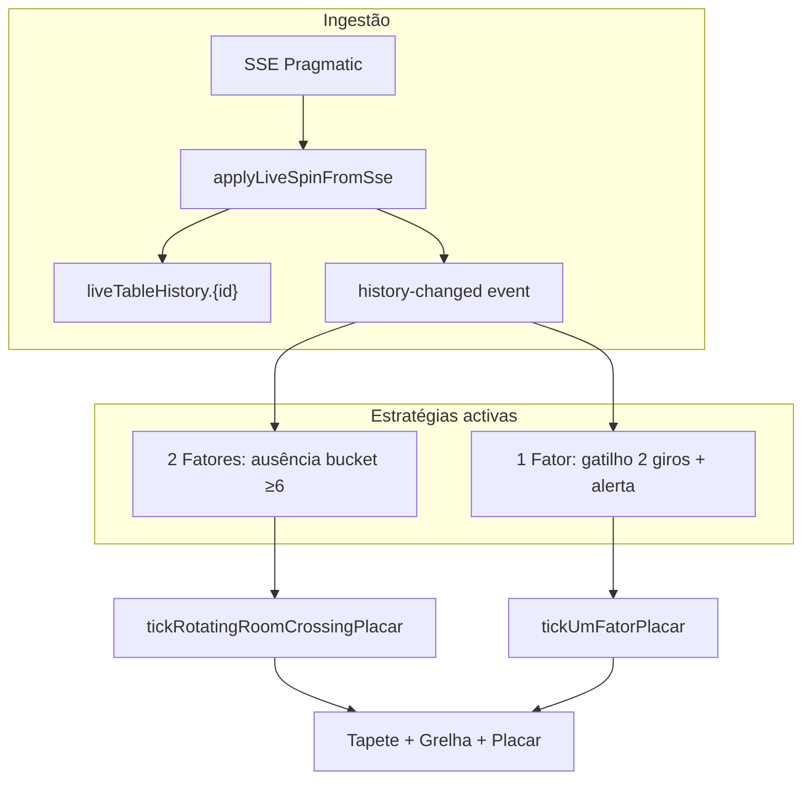

# Cassino ao vivo — Guia de implementação

Documentação para replicar a área **Cassino ao vivo → Roletas** noutro sistema.  
Inclui **apenas as estratégias activas no lobby** (Junho 2026), a **grelha 11×3**, o **tapete**, a **sala rotativa** e o pipeline de histórico ao vivo.

> **Fora de âmbito deste documento:** Ruas 9/20/25%, Números 2,8%, Smart Move, 2 Fatores Plus — rotas legadas que **não** aparecem no menu do lobby.

---

## 1. Visão geral

### Estratégias activas

| ID | Nome UI | Tapete (1 mesa) | Sala rotativa (N mesas) |
|----|---------|-----------------|-------------------------|
| `dois2fatores` | **2 Fatores** | `/dois-fatores?mesa=` | `/sala-rotativa` |
| `um1fator` | **1 Fator** | `/um-fator?mesa=` | `/sala-rotativa-um-fator` |

**Default do lobby:** `dois2fatores`  
**Persistência da aba:** `sessionStorage` → `roulette.lobby.roletasStrategy.v3`

### Arquitectura de dados

```
SSE (Pragmatic) → applyLiveSpinFromSse
                → localStorage: roulette.liveTableHistory.{tableId}
                → localStorage: roulette.liveTableSpinTimes.{tableId}
                → evento: roulette-live-table-history-changed
                → hooks de sessão → tick do placar → machine + stats
                → UI (lobby, tapete, sala)
```

**Convenção obrigatória:** histórico **newest-first** — `history[0]` é sempre o giro mais recente.

---

## 2. Pressupostos da roleta

| Item | Definição |
|------|-----------|
| Tipo | Europeia, números **0–36** |
| Vermelhos | 1,3,5,7,9,12,14,16,18,19,21,23,25,27,30,32,34,36 |
| Baixo | 1–18 |
| Alto | 19–36 |
| Zero | Sem cor/paridade/altura úteis para gatilhos (tratado à parte) |

### Funções base por número

Implementação de referência: `src/lib/roulette/streetPairTrigger.ts`

```ts
colorOf(n): "Vermelho" | "Preto" | "Zero"
heightOf(n): "Baixo" | "Alto" | "Zero"
parityOf(n): "Par" | "Impar" | "Zero"
```

---

## 3. Histórico ao vivo

### Formato

```ts
type LiveHistory = number[];           // newest-first, 0–36
type LiveSpinTimes = (number | null)[]; // epoch ms alinhado ao histórico; null = legado
```

### Chaves de storage

| Chave | Conteúdo |
|-------|----------|
| `roulette.liveTableHistory.{tableId}` | Giros da mesa |
| `roulette.liveTableSpinTimes.{tableId}` | Timestamps por giro |
| `roulette.lastLiveSpinGameId` (sessionStorage) | Dedup SSE |

### Ingestão SSE

Ficheiros: `src/lib/roulette/applyLiveSpinFromSse.ts`, `src/components/live-roulette-sse-bridge.tsx`

1. Recebe giro com `gameId` no formato `{tableId}::{upstreamId}`
2. Ignora duplicados via `lastLiveSpinGameId`
3. Faz `prepend`: `[number, ...históricoAnterior]`
4. Grava histórico + timestamp em paralelo
5. Dispara `ROULETTE_LIVE_TABLE_HISTORY_EVENT` (`roulette-live-table-history-changed`)

### Lista de mesas ao vivo

Evento `ROULETTE_LIVE_TABLE_CONFIG_EVENT` quando o SSE envia `ready` com `tableIds`.  
Ficheiro: `src/lib/roulette/liveTableConfig.ts`

### Dedup no placar

```ts
function spinHead(history: number[]): string {
  if (history.length === 0) return "0";
  return `${history.length}:${history[0]}`;
}
```

O tick só processa quando `spinHead` muda para aquela mesa.

---

## 4. Grelha de histórico 11×3

Ficheiro: `src/components/roulette-history-grid-11x3.tsx`

### Constantes

```ts
ROULETTE_HISTORY_GRID_COLS = 11
ROULETTE_HISTORY_GRID_ROWS = 3   // default
ROULETTE_HISTORY_GRID_CELLS = 33 // 11 × 3
```

### Convenção de índices (newest-first)

| Conceito | Valor |
|----------|-------|
| `history[0]` | Giro mais recente — célula **superior esquerda** (posição UI **1**) |
| Leitura | Horizontal: esquerda → direita, depois linha seguinte |
| Célula índice `i` | `history[i]` |
| Posição UI 11 | `history[10]` |
| Posição UI 12 | `history[11]` |
| Posição UI 22 | `history[21]` |

```
Pos UI:  1   2   3   4   5   6   7   8   9  10  11
Índice:  0   1   2   3   4   5   6   7   8   9  10   ← linha 1

Pos UI: 12  13  14  15  16  17  18  19  20  21  22
Índice: 11  12  13  14  15  16  17  18  19  20  21   ← linha 2

Pos UI: 23  24  25  26  27  28  29  30  31  32  33
Índice: 22  23  24  25  26  27  28  29  30  31  32   ← linha 3
```

### Variantes de linhas (`rows`)

| `rows` | Células | Uso actual |
|--------|---------|------------|
| `1` | 11 giros | — |
| `2` | 22 giros | — |
| `3` | 33 giros | `/dois-fatores`, `/um-fator` |

### Modos visuais

| `colorMode` | Cores das células |
|-------------|-------------------|
| `"color"` (default) | Vermelho / Preto / Verde (zero) |
| `"height"` | Baixo (sky) / Alto (rose) / Verde (zero) |

### Realce opcional (`cellRoleForIndex`)

Usado em estratégias **legadas** (Ruas). Nas estratégias activas **não** se usa.

| Role | Visual |
|------|--------|
| `"compare"` | Anel cyan |
| `"base"` | Anel amber |

### API do componente

```tsx
<RouletteHistoryGrid11x3
  history={number[]}           // newest-first
  rows={1 | 2 | 3}             // default 3
  colorMode="color" | "height" // default "color"
  cellRoleForIndex={(i) => ...} // opcional
/>
```

---

## 5. Tapete da roleta (`DoisFatoresTable`)

Ficheiro: `src/components/dois-fatores-table.tsx`

### Props

| Prop | Tipo | Descrição |
|------|------|-----------|
| `active` | `DoisFatoresActive \| null` | Sinal activo |
| `resultPinNumber` | `number \| null` | Pin no número do resultado (flash) |
| `enlarged` | `boolean` | Tapete grande (sala rotativa) |
| `singleFactor` | `boolean` | **1 Fator:** destaca só `factor1` (alerta) |

### Realce no tapete

Para cada factor activo, calcula chave exterior via `doisFatoresExteriorCellKey(factor)`:

| Factor | Chave | Zona no tapete |
|--------|-------|----------------|
| Cor Vermelho | `red` | Dúzia/coluna vermelha exterior |
| Cor Preto | `black` | Zona preta exterior |
| Paridade Par | `even` | Par |
| Paridade Ímpar | `odd` | Ímpar |
| Altura Baixo | `low` | 1–18 |
| Altura Alto | `high` | 19–36 |

- **2 Fatores:** realça `factor1` **e** `factor2` (fichas «1» em cada zona)
- **1 Fator:** realça só `factor1` (= factor alertado)

### Tipo `DoisFatoresActive`

```ts
type DoisFatoresActive = {
  pairKind: "cor-paridade" | "cor-altura" | "altura-paridade";
  pairKindLabel: string;           // ex. "Cor · Altura"
  patternMode: "convergence" | "divergence"; // usado em simulações legadas
  patternStats: { convergence, divergence, alternation, safetyMode };
  referenceNumber: number;
  factor1: DoisFatoresFactor;
  factor2: DoisFatoresFactor;
  triggerNumbers: [number, number];
  armingDescription: string;
};

type DoisFatoresFactor =
  | { kind: "cor"; value: "Vermelho" | "Preto" }
  | { kind: "paridade"; value: "Par" | "Impar" }
  | { kind: "altura"; value: "Baixo" | "Alto" };
```

### Avaliação de giro — 2 Fatores

Ficheiro: `src/lib/roulette/doisFatoresStrategy.ts` → `evaluateDoisFatoresRound`

```ts
function evaluateDoisFatoresRound(num, active): "W" | "L" | "continue" {
  if (num === 0) return "L";
  const f1Win = factorWins(num, active.factor1);
  const f2Win = factorWins(num, active.factor2);
  if (f1Win && f2Win) return "W";      // ambos acertam
  if (!f1Win && !f2Win) return "L";     // ambos erram
  return "continue";                     // um acerta, outro não
}
```

---

## 6. Estratégia 2 Fatores (`dois2fatores`)

### Regra de gatilho (cruzamento por ausência)

**Não** usa a grelha 2×5 do módulo `doisFatoresStrategy` (Fatores 3,2% legado).  
Usa **ausência de cruzamento** em `liveTableColdStats.ts`.

**Eixos activos:** `cor-altura` e `altura-paridade` (não usa `cor-paridade`).

**12 buckets** (`CROSSING_BUCKET_DEFINITIONS`): combinações cor×metade, cor×paridade, metade×paridade — ver `liveTableColdStats.ts`.

**Gatilho:** um bucket (ex. «Preto · Baixo») **não saiu** há ≥ **6** giros (`ROTATING_ROOM_CROSSING_MIN_ABSENCE_SPINS`).

```ts
bucketGap = crossingBucketAbsenceGap(history, bucketDef);
// giros desde que qualquer número do bucket apareceu
alerta se bucketGap >= 6
```

**Factor1 e Factor2** do alerta = os dois componentes do bucket ausente (ex. Preto + Baixo).

### Fluxo da sessão (sala rotativa)

```
scanning → prepare (POSICIONAR, 1 giro) → active (JOGANDO)
         → awaiting_queue / await_switch (após derrota parcial)
```

| Modo | Descrição |
|------|-----------|
| `scanning` | A analisar mesas |
| `prepare` | Alerta detectado; aguarda 1 giro antes de apostar |
| `active` | Sinal no tapete; avalia cada giro novo |
| `awaiting_queue` | Fila de alertas noutras mesas |
| `await_switch` | Troca de mesa após derrota parcial |

### Recuperação

- Máximo **5** níveis (`ROTATING_ROOM_CROSSING_MAX_RECOVERY`)
- `continue` (um factor acerta) → mantém sinal, não fecha ciclo
- Derrota parcial (`L` com recuperação < 5) → suspende mesa, pode trocar
- Derrota final (recuperação esgotada) → +1 no placar `losses`

### Máquina de estado — `RotatingRoomCrossingMachineState`

Ficheiro: `src/lib/roulette/rotatingRoomCrossingStrategy.ts`

| Campo | Função |
|-------|--------|
| `cycleTableId` | Mesa em jogo |
| `cycleActive` | `DoisFatoresActive` vigente |
| `recovery` | Nível 0–5 |
| `prepareTableId` / `prepareActive` | Fase POSICIONAR |
| `signalQueue` | Fila multi-mesa |
| `tablePlacarLosses` | Suspensão por mesa após derrota parcial |
| `lastLostTableId` | Evita repetir mesa logo após perda |
| `lastSpinHeadByTable` | Dedup por mesa |
| `armedAtHead` | Cabeçalho no armamento do prepare |

### Tick do placar

Função: `tickRotatingRoomCrossingPlacar(tableIds, histories, machine, stats)`

Ordem por giro novo:
1. Sincroniza `lastSpinHeadByTable`
2. Se em `prepare` e head mudou → avalia giro de transição ou cancela se bucket já não ausente
3. Se em `active` → `evaluateDoisFatoresRound` → W / L / continue
4. Se em `scanning` → detecta novo alerta, arma prepare ou fila
5. Grava machine + stats; emite flash (`win` | `loss` | `recovery`)

### Storage

**Por mesa** (`doisFatoresCrossingStrategy.ts`):

| Chave | Conteúdo |
|-------|----------|
| `roulette.doisFatoresCrossing.stats.{tableId}` | Placar |
| `roulette.doisFatoresCrossing.machine.v1.{tableId}` | Máquina |
| `roulette.doisFatoresCrossing.placarAnchor.{tableId}` | Âncora pós-reset |

**Sala rotativa global**:

| Chave | Conteúdo |
|-------|----------|
| `roulette.rotatingRoomCrossing.stats.v1` | Placar global |
| `roulette.rotatingRoomCrossing.machine.v1` | Máquina global |

### Eventos

- `dois-fatores-crossing-changed` / `dois-fatores-crossing-reset`
- `rotating-room-crossing-changed` / `rotating-room-crossing-reset` / `rotating-room-crossing-stats-corrected`

### Hooks e rotas

| Hook | Scope | Ficheiro |
|------|-------|----------|
| `useDoisFatoresCrossingSession` | 1 mesa | `src/hooks/useDoisFatoresCrossingSession.ts` |
| `useRotatingRoomCrossingSession` | N mesas | `src/hooks/useRotatingRoomCrossingSession.ts` |

| Rota | Ficheiro |
|------|----------|
| `/dois-fatores` | `src/routes/dois-fatores.tsx` |
| `/sala-rotativa` | `src/routes/sala-rotativa.tsx` |

---

## 7. Estratégia 1 Fator (`um1fator`)

Ficheiro principal: `src/lib/roulette/umFatorStrategy.ts`

### Regras

**Histórico mínimo:** 3 giros (`UM_FATOR_MIN_HISTORY`)

| Posição (newest-first) | Papel |
|------------------------|-------|
| `history[0]` | Giro actual / formação do alerta |
| `history[1]` | 1.º giro de gatilho |
| `history[2]` | 2.º giro de gatilho |

**Gatilho:** `history[1]` e `history[2]` coincidem nos **dois** factores de um eixo:
- `cor-altura` (cor + altura iguais)
- `altura-paridade` (altura + paridade iguais)

Zeros em qualquer posição 0–2 → sem gatilho.

**Formação do alerta** (no giro `history[0]`):
- Se o número tem **exactamente 1** dos dois parâmetros do gatilho → alerta é o **outro** parâmetro
- Se tem **ambos** ou **nenhum** → sem alerta

**Placar** (no **próximo** giro após formação):

```ts
function evaluateUmFatorRound(num, active): "W" | "L" {
  if (num === 0) return "L";
  return factorWins(num, active.alertFactor) ? "W" : "L";
}
```

### Tier do gatilho (estatísticas internas)

Conta quantos dos 3 factores (cor, altura, paridade) coincidem entre `history[1]` e `history[2]`:
- **2 factores iguais** → `triggerMatchTier: "two"`
- **3 factores iguais** → `triggerMatchTier: "three"`

### Fluxo temporal (3 giros)

```
Giro A: history[2], history[1] formam gatilho (par ainda não visível só com 2 giros)
Giro B: history[1], history[2] + history[0]=B → detecta formação; arma pending
Giro C: history[0]=C → avalia W/L contra alertFactor
```

### Máquina — `UmFatorMachineState`

Ficheiro: `src/lib/roulette/rotatingRoomUmFatorStrategy.ts`

| Campo | Função |
|-------|--------|
| `pendingByTable[tableId]` | `{ active, armedHead }` — alerta à espera do giro de resultado |
| `settledSpinHeadByTable` | Evita liquidar o mesmo giro duas vezes |
| `focusLockTableId` | Bloqueia troca de mesa com entrada aberta |
| `recovery` | 0–5 |
| `lastActiveTableId` | Stickiness na sala rotativa |

### Tick — `tickUmFatorPlacar`

Por mesa, por giro:
1. Se `pending` e head mudou → avalia resultado, limpa pending, actualiza placar
2. Senão, se formação detectada e janela de apostas OK → arma `pending`
3. Uma acção por tick (break após armar ou liquidar)

**Sala rotativa:** `anyTablePendingEntryOpen` impede armar formação noutra mesa enquanto há entrada aberta.

### Aprendizado de padrões (opcional, background)

Ficheiros: `umFatorPatternLearning.ts`, `umFatorReplay.ts`  
Aprende assinaturas de sequência e prioriza mesas/gatilhos. **UI oculta** — corre em background na sala.

### Storage

**Por mesa** (`umFatorCrossingStrategy.ts`):

| Chave | Conteúdo |
|-------|----------|
| `roulette.umFator.stats.{tableId}` | Placar |
| `roulette.umFator.machine.v1.{tableId}` | Máquina |
| `roulette.umFator.placarAnchor.{tableId}` | Âncora pós-reset |

**Sala rotativa**:

| Chave | Conteúdo |
|-------|----------|
| `roulette.rotatingRoomUmFator.stats.v1` | Placar global |
| `roulette.rotatingRoomUmFator.machine.v1` | Máquina global |
| `roulette.umFator.patternLearning.v1` | Buckets IA (opcional) |

### Adaptador para tapete

```ts
umFatorToTapeteActive(active: UmFatorActive): DoisFatoresActive
// factor1 = alertFactor; factor2 = triggerFactor1; singleFactor=true na UI
```

### Hooks e rotas

| Hook | Scope |
|------|-------|
| `useUmFatorSession` | 1 mesa |
| `useRotatingRoomUmFatorSession` | N mesas |
| `useUmFatorPatternLearning` | Rebuild IA (sala) |

| Rota | Ficheiro |
|------|----------|
| `/um-fator` | `src/routes/um-fator.tsx` |
| `/sala-rotativa-um-fator` | `src/routes/sala-rotativa-um-fator.tsx` |

---

## 8. Placar e estatísticas

### Tipo `RotatingRoomSessionStats`

```ts
type RotatingRoomSessionStats = {
  wins: number;
  losses: number;
  winsAtRecovery?: number[];    // índice = nível de recuperação na vitória
  lossesAtRecovery?: number[];  // derrotas parciais por nível
  umFatorMatchTier?: {          // só 1 Fator (tracking interno)
    twoEqualFactors: { wins, losses };
    threeEqualFactors: { wins, losses };
  };
};
```

**Aproveitamento:** `wins / (wins + losses) × 100`

Funções de registo: `entryWinBreakdown.ts`
- `recordRotatingRoomSessionWin`
- `recordRotatingRoomSessionPartialLoss` (não incrementa `losses`)
- `recordRotatingRoomSessionFinalLoss` (incrementa `losses`)

### Flash de resultado (UI)

Duração: **2800 ms** (`ROUND_FLASH_MS`)

| `kind` | Significado |
|--------|-------------|
| `win` | Vitória |
| `loss` | Derrota final (ciclo fechado) |
| `recovery` | Derrota parcial (entra em recuperação) |

---

## 9. Sala rotativa — infraestrutura

### Mesas do rodízio

Ordem fixa (`buildRotatingRoomTableIds`):

1. `227` — Roulette 1  
2. `230` — Roulette 3  
3. `201` — Roulette 2 Extra Time  
4. **Macao** — ID dinâmico (`resolveMacaoTableIdFromLiveTableIds`)  
5. `237` — Roulette Brasileira  

**Excluídas:** `203`, `205` (Speed 1/2)

Filtradas pelo SSE: só mesas presentes em `liveIds`.

### Janela de apostas

Ficheiro: `src/lib/roulette/liveTableBettingWindow.ts`

| Constante | Valor |
|-----------|-------|
| `LIVE_TABLE_BETTING_WINDOW_SEC` | 20 s após o último giro |
| `ROTATING_ROOM_MIN_BETTING_TIME_REMAINING_SEC` | 10 s mínimo para trocar de mesa |

```ts
tableAcceptableForRotatingRoomEntry(tableId, history)
// true se restam ≥ 10s na janela de 20s
```

### Selecção de mesa no iframe

Ficheiro: `src/components/sala-rotativa-workspace.tsx`

Prioridade (`resolveFocusTableId`):
1. `roundFlash.tableId` (resultado recente)
2. `currentTableId` com sinal activo
3. `prepareTableId` (só 2 Fatores)

Troca de iframe bloqueada se:
- Há alerta activo ou flash, **ou**
- `tableAcceptableForRotatingRoomEntry` é true

### Componentes da sala

| Componente | Ficheiro | Função |
|------------|----------|--------|
| `SalaRotativaWorkspace` | `sala-rotativa-workspace.tsx` | Layout iframe + painel flutuante |
| `RotatingRoomPanel` | `rotating-room-panel.tsx` | Stats, tapete, scan por mesa |
| `CasinoGameEmbedFrame` | `casino-game-embed-frame.tsx` | iframe do operador |
| `RotatingRoomClickBotPanel` | `rotating-room-click-bot-panel.tsx` | Automação de cliques (extensão) |

### Modos de visualização

- **Modo iframe:** painel flutuante sobre o jogo; offset persistido em `roulette.rotatingRoom.panelOffset.v1`
- **Modo moldura:** controlos de crop/zoom (`useCasinoEmbedViewport`)

### Hooks partilhados

| Hook | Função |
|------|--------|
| `useRotatingRoomHistories` | Lê histórico de todas as mesas do rodízio |
| `useRotatingRoomCrossingSession` | Sessão 2 Fatores |
| `useRotatingRoomUmFatorSession` | Sessão 1 Fator |

**Lobby:** hooks com `observeOnly: true` — lê stats da mesma storage, **sem** sons/flash.

---

## 10. Lobby (Cassino ao vivo)

Ficheiro: `src/components/roulette-lobby-page.tsx`

### Sub-abas

| Aba | Conteúdo |
|-----|----------|
| `roletas` | Cartões de mesa + selector de estratégia + cartão Sala Rotativa |
| `simulador` | Simulador |
| `outros` | Outros jogos |
| `estatisticas` | Tabela W/L por mesa |

### Cartões de mesa

- 12 mesas fixas (`LOBBY_FIXED_TABLE_IDS`)
- Link para `/dois-fatores?mesa=` ou `/um-fator?mesa=`
- Badge de aproveitamento + breakdown de ganhos por nível de recuperação (2 Fatores)
- Badge «Sinal activo» quando `showTapeteSignal` ou `prepare`
- Ordenação por aproveitamento descendente

### Cartão Sala Rotativa

- Link: `/sala-rotativa` ou `/sala-rotativa-um-fator`
- Mostra mesa em foco e aproveitamento global da sala

### Reset de placar

«Zerar histórico» reseta stats + machine de **todas** as mesas + sala global.

---

## 11. Mapa de ficheiros de referência

```
src/lib/roulette/
  lobbyTables.ts              — mesas, estratégias, rodízio
  historyStorage.ts           — histórico ao vivo, eventos
  applyLiveSpinFromSse.ts     — ingestão SSE
  liveTableConfig.ts          — lista de mesas ready
  liveTableBettingWindow.ts   — janela 20s / mínimo 10s
  liveTableColdStats.ts       — buckets de cruzamento (2 Fatores)
  doisFatoresStrategy.ts      — evaluateDoisFatoresRound, tapete
  doisFatoresCrossingStrategy.ts — wrapper por mesa (2F)
  rotatingRoomCrossingStrategy.ts — motor sala 2 Fatores
  umFatorStrategy.ts            — motor 1 Fator
  umFatorCrossingStrategy.ts    — wrapper por mesa (1F)
  rotatingRoomUmFatorStrategy.ts — motor sala 1 Fator
  rotatingRoomUmFatorSession.ts  — persistência sala 1F
  entryWinBreakdown.ts          — placar W/L/recuperação
  umFatorPatternLearning.ts     — IA padrões (opcional)

src/hooks/
  useDoisFatoresCrossingSession.ts
  useRotatingRoomCrossingSession.ts
  useUmFatorSession.ts
  useRotatingRoomUmFatorSession.ts
  useRotatingRoomHistories.ts
  useUmFatorPatternLearning.ts

src/components/
  roulette-history-grid-11x3.tsx
  dois-fatores-table.tsx
  rotating-room-panel.tsx
  sala-rotativa-workspace.tsx
  roulette-lobby-page.tsx

src/routes/
  dois-fatores.tsx
  um-fator.tsx
  sala-rotativa.tsx
  sala-rotativa-um-fator.tsx
```

---

## 12. Checklist de portagem

### Infraestrutura

- [ ] Roleta europeia 0–36; histórico **newest-first** em todo o pipeline
- [ ] SSE com dedup `gameId` e evento de lista de mesas `ready`
- [ ] Storage por mesa: histórico + timestamps paralelos
- [ ] Event bus para notificar UI após cada giro
- [ ] `spinHead` para dedup no tick do placar

### Grelha 11×3

- [ ] 11 colunas × até 3 linhas; índice 0 = topo-esquerda
- [ ] Modos cor e altura; células vazias quando histórico < capacidade

### Tapete

- [ ] Grelha 0–36 + apostas exteriores
- [ ] Realce por `doisFatoresExteriorCellKey` (6 zonas)
- [ ] Modo `singleFactor` para 1 Fator

### 2 Fatores

- [ ] 12 buckets de cruzamento; eixos cor-altura e altura-paridade
- [ ] Ausência ≥ 6 giros para alerta
- [ ] Estados scanning → prepare → active + fila multi-mesa
- [ ] `evaluateDoisFatoresRound`: W / L / continue
- [ ] Recuperação 0–5; derrota parcial com troca de mesa
- [ ] Storage máquina + stats (por mesa e global sala)

### 1 Fator

- [ ] Gatilho em history[1]+history[2]; alerta em history[0]; resultado no giro seguinte
- [ ] `pendingByTable` + `armedHead`
- [ ] `evaluateUmFatorRound`: W / L binário
- [ ] Recuperação 0–5; focusLock na sala
- [ ] `umFatorToTapeteActive` + `singleFactor` na UI

### Sala rotativa

- [ ] Rodízio 5 mesas (R1, R3, Extra Time, Macao, Brasileira)
- [ ] Janela apostas 20s; mín. 10s para trocar
- [ ] Iframe com URL configurável por mesa
- [ ] Tick só com tab visível (`document.visibilityState`)
- [ ] Lobby observe-only partilhando storage

### UI / rotas

- [ ] Lobby com selector `dois2fatores` | `um1fator`
- [ ] 4 rotas: tapete ×2 + sala ×2
- [ ] Flash 2,8s; sons opcionais em vitória/derrota

---

## 13. Diagrama de fluxo



---

*Gerado a partir do repositório game-odds-glow — estratégias activas em Junho 2026.*
