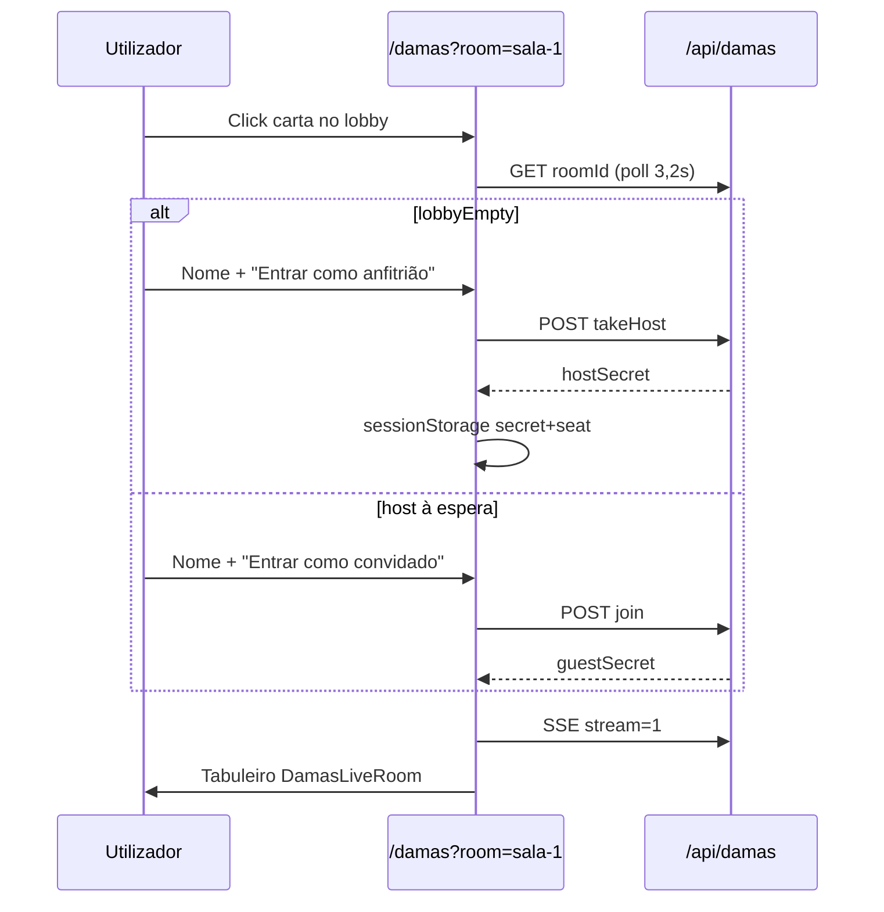

# Damas online — documentação para implementação externa

Guia de referência da aba **Dama on line** do lobby: visual, salas, API, fluxos e regras. Destinado a replicar o comportamento noutro sistema (web, mobile ou backend separado).

---

## 1. Visão geral

| Aspecto | Implementação actual |
|--------|----------------------|
| Modo | Multijogador 1×1 em tempo real |
| Transporte | **REST** + **SSE** (Server-Sent Events). **Sem WebSocket** |
| Autenticação | **Nenhuma** — identificação por `secret` por jogador |
| Persistência servidor | **Memória RAM** (`Map`) — perde estado ao reiniciar |
| Persistência cliente | `sessionStorage` (token + lugar) |
| Chat / espectadores | **Não implementados** na UI |

---

## 2. Navegação e rotas

### 2.1 Acesso pelo lobby principal (`/`)

```
Lobby (/) 
  └─ Sidebar: "Jogos de Tabuleiro" (mainTab = tabuleiro, ícone Dices amber)
       └─ Sub-aba: "Dama on line" (boardGamesSubTab = damasOnline)
            └─ <DamasLobbyGrid /> (3 cartas inline, sem mudar de URL)
                 └─ Click carta → /damas?room=sala-1 | sala-2
```

**Ficheiros:** `src/routes/index.tsx`, `src/components/roulette-lobby-page.tsx`, `src/components/damas/DamasLobbyGrid.tsx`

### 2.2 Página dedicada (`/damas`)

| URL | Conteúdo |
|-----|----------|
| `/damas` | Grid de salas + criar/entrar sala privada |
| `/damas?room=sala-1` | Sala partilhada 1 |
| `/damas?room=sala-2` | Sala partilhada 2 |
| `/damas?room=sala-vip` | Placeholder VIP |
| `/damas?room={hex10}` | Sala privada (código ≥ 4 chars) |

**Validação `room`:** aceita `sala-1`, `sala-2`, `sala-vip` ou qualquer string com ≥ 4 caracteres.

**Ficheiro:** `src/routes/damas.tsx`

---

## 3. Salas

### 3.1 IDs fixos (`src/lib/damas/fixedRooms.ts`)

| ID | Label UI | Tipo | Comportamento |
|----|----------|------|---------------|
| `sala-1` | Sala 1 | Partilhada | Host via `takeHost`; aparece no lobby |
| `sala-2` | Sala 2 | Partilhada | Idem |
| `sala-vip` | Sala VIP | Placeholder | Carta não clicável; API rejeita acções |

### 3.2 Salas privadas

- Criadas com `POST action: "create"`.
- `roomId`: 10 caracteres hex aleatórios.
- **Não** aparecem no lobby — só por link/código.

### 3.3 Lugares (seats)

| Seat | Valor | Peças | Posição no tabuleiro |
|------|-------|-------|----------------------|
| Anfitrião | `0` | Vermelhas | Topo (linhas 0–2) |
| Convidado | `1` | Brancas | Fundo (linhas 5–7) |

Vermelhas (`0`) jogam primeiro.

### 3.4 Estados da sala (footer das cartas)

| `footerStatus` | Condição |
|----------------|----------|
| `Vazia` | Sala fixa sem `hostSecret` |
| `Aguardando jogador` | Host presente, sem guest |
| `Em jogo` | 2 jogadores, sem vencedor |
| `Partida terminada` | `winner !== null` |
| `Programado — em breve` | Sala VIP |

### 3.5 Estado público (`DamasPublicState`)

```typescript
type DamasPublicState = {
  roomId: string;
  seat: 0 | 1 | null;           // quem pediu (com secret)
  hostName: string;
  guestName: string | null;
  board: DamasBoard;             // 8×8
  turn: 0 | 1;
  winner: 0 | 1 | "draw" | null;
  mustContinueFrom: { r, c } | null;  // multi-captura
  version: number;                 // incrementa a cada mudança
  lobbyEmpty?: boolean;            // sala fixa sem host
};
```

**Nunca** expor `hostSecret` / `guestSecret` ao cliente público.

---

## 4. Visual e design system

### 4.1 Paleta global

| Uso | Valor |
|-----|-------|
| Fundo página | `#080d18` |
| Fundo cards | `#0d1524` |
| Texto principal | `slate-100` / `white` |
| Texto secundário | `slate-400` / `slate-500` |
| CTA primário | `cyan-600` → hover `cyan-500` |
| Salas activas | `emerald` (950/400/700) |
| VIP | `amber` (500/950/200) |
| Erros | `red-500/10`, borda `red-500/35` |

### 4.2 Grid do lobby

```
grid-cols-1 sm:grid-cols-2 lg:grid-cols-3
gap-5
Skeleton loading: h-[320px] animate-pulse (3 cartas)
Polling: GET /api/damas?lobby=1 a cada 2,8 s
```

### 4.3 Carta de sala (`DamasLobbySlotCard`)

**Estrutura vertical:**

1. **Faixa superior** (`min-h-[3.75rem]`, border-b)
   - Normal: gradiente `from-emerald-950 via-slate-900 to-emerald-950`, ícone `Dices` emerald
   - VIP: gradiente amber, ícone `Crown`, texto "Programado"
   - Status em uppercase (`text-[9px] tracking-[0.22em]`)
   - Título: `Sala 1`, `Sala 2`, `Sala VIP`

2. **Corpo imagem** (`aspect-[16/10]`)
   - Normal: `background-image: url(/damas/lobby-board.png)` + overlay escuro
   - VIP: gradiente + ícone `Dices` grande semi-transparente + badge central glass:
     - Linha 1: "Sala VIP"
     - Linha 2: "Em breve"
     - Estilo: `bg-white/22 backdrop-blur`, borda `white/40`

3. **Rodapé**
   - Título + `Jogadores X/2` (emerald glow)
   - Subtítulo: `Casa · sala-1` ou `Funcionamento programado`
   - Ícone decorativo `♡` (não funcional)

**Bordas:**
- Normal: `border-slate-800/80`
- VIP: `border-amber-500/45 ring-amber-500/25 shadow amber`

**Interacção:**
- Normal: `<Link>` para `/damas?room={id}`, hover opacity 0.98, focus ring cyan
- VIP: `cursor-not-allowed`, sem link

**Asset:** `public/damas/lobby-board.png`

### 4.4 Página `/damas`

**Header:**
- Título: "Damas ao vivo"
- Subtítulo: explica salas 1/2 partilhadas e VIP em configuração
- Botão "← Lobby" → `/`

**Formulários sala privada** (grid 2 colunas em `sm+`):
- **Criar sala:** nome → botão cyan "Criar e abrir sala"
- **Entrar:** código sala (mono) + nome → botão outline cyan "Entrar"

**Sala VIP:** card amber centrado, "Funcionamento programado", link "Voltar às salas"

### 4.5 Tabuleiro in-game (`DamasLiveRoom`)

| Elemento | Estilo |
|----------|--------|
| Grid | 8×8, células `2.5rem`, `border-slate-700` |
| Casa escura (jogável) | `bg-amber-900/50` |
| Casa clara | `bg-slate-900/80`, disabled |
| Seleccionada | `ring-2 ring-cyan-400` |
| Captura obrigatória | `ring-2 ring-amber-400` |
| Peça vermelha (0) | `bg-red-700/90`, borda `red-300` |
| Peça branca (1) | `bg-slate-100`, texto escuro |
| Dama | `ring-yellow-400`, letra **"D"** |

**Textos de estado:**
- "É a tua vez." / "Aguarda o adversário."
- "Continuação de captura: tens de jogar com a peça marcada."
- "Ganhaste!" / "Vitória do adversário." / "Empate."
- Sem token: banner amber pedindo reentrada

**Legenda:** pedras avançam na diagonal; capturas obrigatórias; dama na última fila.

---

## 5. API `/api/damas`

**Ficheiro:** `src/routes/api/damas.ts`  
**Backend:** `src/lib/server/damasServerState.ts`

### 5.1 GET

| Query | Resposta |
|-------|----------|
| `?lobby=1` | `{ slots: DamasLobbySlotSnapshot[] }` — 2 slots + VIP |
| `?roomId=X` | `DamasPublicState` (sem seat ou seat null) |
| `?roomId=X&secret=Y` | `DamasPublicState` com `seat` do jogador |
| `?stream=1&roomId=X&secret=Y` | **SSE** — eventos `data: {"type":"state","state":...}` |

**SSE:** keepalive `: keepalive\n\n` a cada 25 s; broadcast após join/move/host.

**Erros:** `{ error: string }` com HTTP 400/404.

### 5.2 POST (JSON)

Corpo comum: `{ action: string, ... }`

#### `create`

```json
{ "action": "create", "hostName": "Visitante" }
```

**Resposta 200:**

```json
{ "roomId": "a1b2c3d4e5", "hostSecret": "...", "seat": 0 }
```

#### `takeHost` (salas fixas vazias)

```json
{ "action": "takeHost", "roomId": "sala-1", "hostName": "Visitante" }
```

**Resposta 200:**

```json
{ "hostSecret": "...", "seat": 0 }
```

**Erros:** sala VIP, sala cheia, não encontrada.

#### `join`

```json
{ "action": "join", "roomId": "sala-1", "guestName": "Visitante 2" }
```

**Resposta 200:**

```json
{ "guestSecret": "...", "seat": 1 }
```

#### `move`

```json
{
  "action": "move",
  "roomId": "sala-1",
  "secret": "...",
  "from": [2, 1],
  "to": [3, 2]
}
```

**Resposta 200:**

```json
{ "state": { /* DamasPublicState */ } }
```

**Erro 400:** `{ "error": "...", "state": { ... } }` (estado actual incluído).

---

## 6. Fluxos de utilizador

### 6.1 Ver salas no lobby

1. Abrir `/` → sidebar **Jogos de Tabuleiro** → **Dama on line**
2. Grid mostra 3 cartas com estado ao vivo (polling 2,8 s)

### 6.2 Entrar sala partilhada (Sala 1 ou 2)



### 6.3 Sala privada

1. `/damas` → **Criar sala** → redirect `?room={id}` + guardar secret
2. Partilhar link: `{origin}/damas?room={roomId}`
3. Adversário: colar código em **Entrar numa sala** ou abrir link

### 6.4 Jogada

1. SSE mantém `state` actualizado
2. Click peça própria → seleccionar origem
3. Click destino → `POST move`
4. Servidor valida, aplica, incrementa `version`, broadcast SSE

### 6.5 Reconexão

- Cliente lê `sessionStorage`:
  - `damas.secret.{roomId}`
  - `damas.seat.{roomId}` (`"0"` ou `"1"`)
- Secret inválido → 404 "Token inválido."
- Secret perdido → banner amber; utilizador deve reentrar

---

## 7. Regras do jogo (`src/lib/damas/engine.ts`)

### Tabuleiro

- 8×8; só casas escuras `(r + c) % 2 === 1` são jogáveis
- Início: 12 peças por jogador nas 3 primeiras filas de cada lado

### Movimentos

| Peça | Movimento simples | Captura |
|------|-------------------|---------|
| Pedra | 1 diagonal **para frente** | Salto sobre adversário |
| Dama | 1 diagonal qualquer | Salto qualquer diagonal |

**Capturas obrigatórias:** se existir captura legal, movimentos simples são ilegais.

**Multi-captura:** após captura, se a mesma peça pode capturar de novo, `mustContinueFrom` fixa essa peça até terminar ou não poder mais capturar.

### Coroação

- Owner `0` → dama na linha `r === 7`
- Owner `1` → dama na linha `r === 0`

### Fim de partida

1. Adversário sem peças → vitória
2. Adversário sem jogadas legais → vitória de quem **não** está no turno

`"draw"` existe no tipo mas **não é atribuído** pelo servidor actual.

---

## 8. Tipos TypeScript (`src/lib/damas/types.ts`)

```typescript
type DamasOwner = 0 | 1;
type Pos = { r: number; c: number };
type DamasPiece = { owner: DamasOwner; king: boolean };
type DamasBoard = (DamasPiece | null)[][];

type DamasLobbySlotSnapshot =
  | { kind: "slot"; roomId; label; playerCount: 0|1|2; footerStatus; hostName; guestName; version }
  | { kind: "vip"; roomId; label; footerStatus: "Programado — em breve" };
```

---

## 9. Mapa de ficheiros

```
src/
├── routes/
│   ├── damas.tsx                 # Página /damas
│   └── api/damas.ts              # REST + SSE
├── components/
│   ├── damas/
│   │   ├── DamasLobbyGrid.tsx    # Grid + cartas lobby
│   │   └── DamasLiveRoom.tsx     # Tabuleiro + SSE + jogadas
│   └── roulette-lobby-page.tsx   # Integração aba tabuleiro
└── lib/
    ├── damas/
    │   ├── types.ts
    │   ├── fixedRooms.ts
    │   └── engine.ts             # Regras puras
    └── server/
        └── damasServerState.ts   # Estado in-memory + broadcast

public/damas/lobby-board.png      # Imagem cartas
```

---

## 10. Checklist para implementação noutro sistema

### Backend mínimo

- [ ] `Map<roomId, Room>` em memória (ou DB se quiser persistência)
- [ ] Inicializar `sala-1` e `sala-2` vazias ao arranque
- [ ] Gerar `hostSecret` / `guestSecret` criptograficamente seguros
- [ ] Endpoints GET lobby, GET state, POST create/takeHost/join/move
- [ ] SSE por sala ou WebSocket equivalente com broadcast em mudanças
- [ ] Motor de regras equivalente a `engine.ts`

### Frontend mínimo

- [ ] Grid 3 cartas com polling lobby
- [ ] Página sala com fluxos host/guest
- [ ] Tabuleiro 8×8 clicável (2 clicks: origem → destino)
- [ ] Subscrição tempo real
- [ ] Guardar secret + seat em storage local
- [ ] Link de convite copiável

### Visual (fidelidade ao actual)

- [ ] Cores `#080d18`, `#0d1524`, emerald/cyan/amber
- [ ] Cartas `aspect-[16/10]` com imagem tabuleiro
- [ ] VIP com badge glass "Em breve"
- [ ] Peças vermelhas/brancas + "D" para dama
- [ ] Rings cyan (selecção) e amber (captura obrigatória)

### Opcional (não existe hoje)

- Chat
- Espectadores com UI
- Rematch / reset após vitória
- Persistência entre restarts
- Autenticação de utilizadores
- Sala VIP com regras próprias

---

## 11. Limitações conhecidas

- Estado volátil — restart do servidor apaga todas as salas
- Sem rematch automático após `winner`
- Polling redundante (lobby 2,8 s + página sala 3,2 s + SSE in-game)
- Conta "Visitante" no lobby global é cosmética — não ligada às salas de damas
- `sala-vip` é apenas UI placeholder

---

*Documento gerado a partir do código em `game-odds-glow`. Versão alinhada ao commit actual do repositório.*
